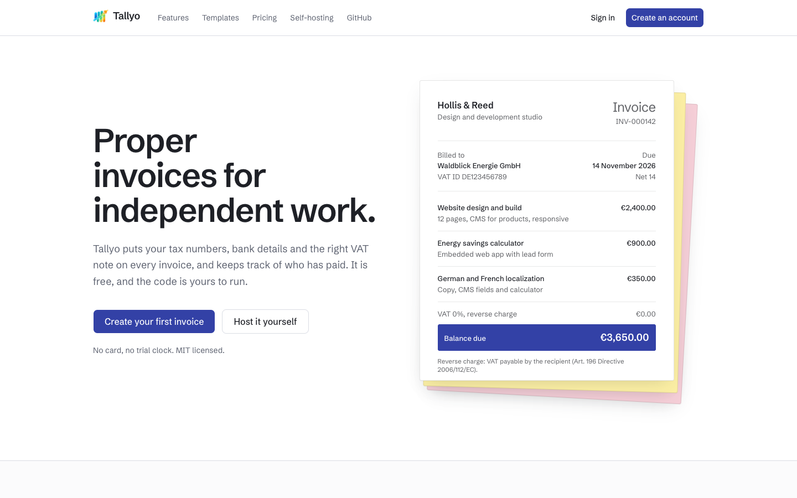
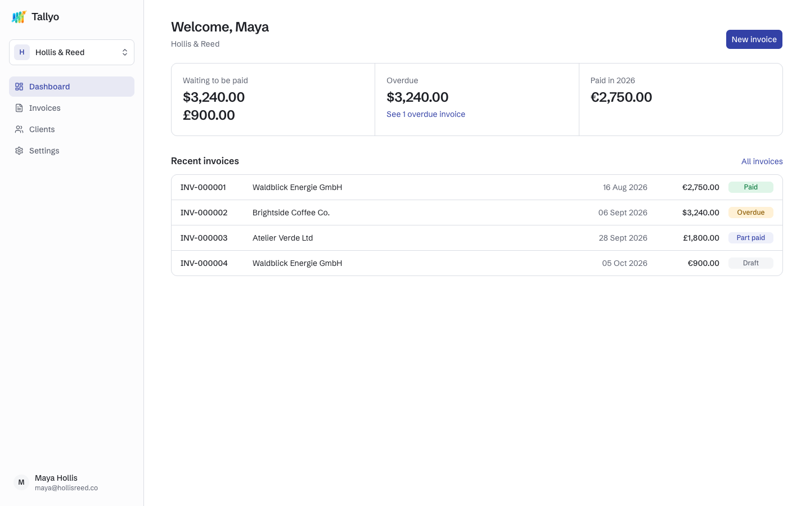
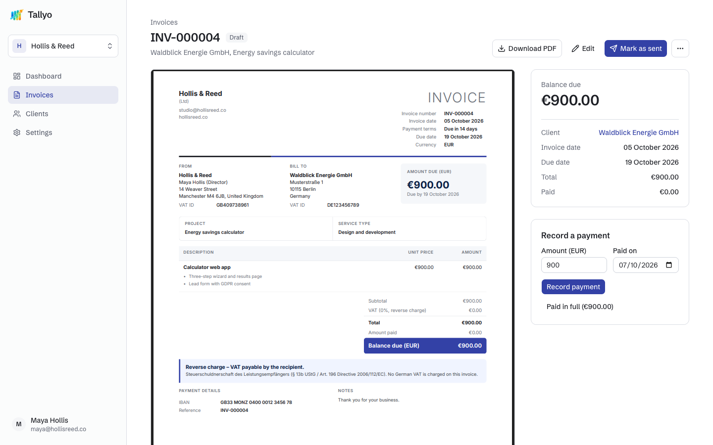
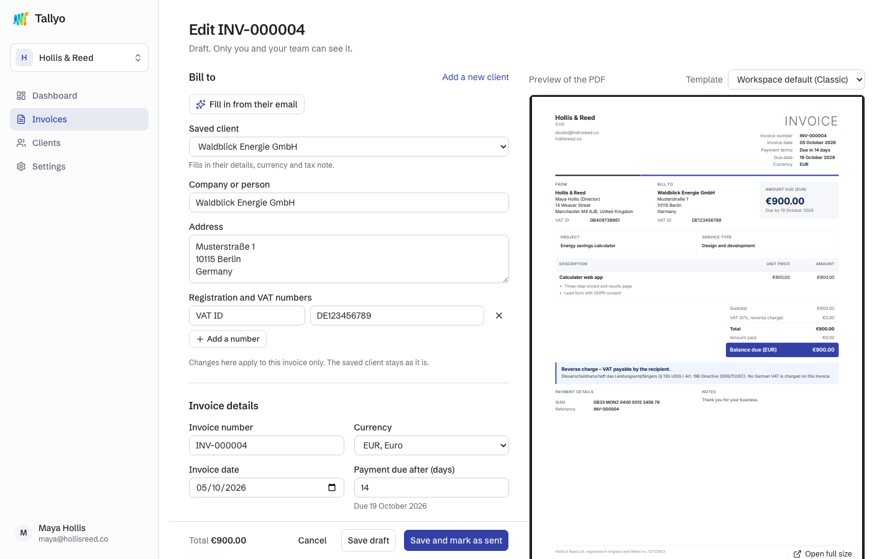
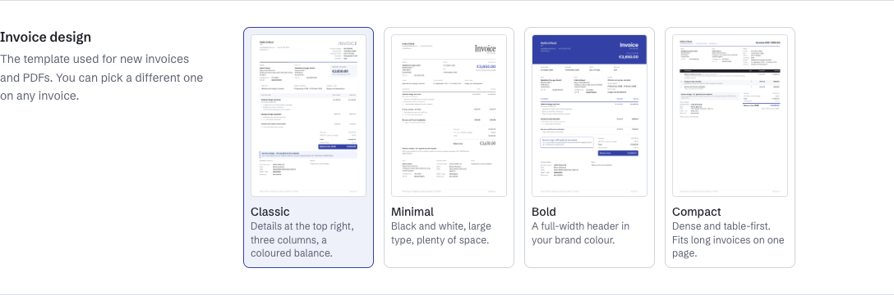

<p align="center">
  
</p>

<h1 align="center">Tallyo</h1>

<p align="center">
  Open-source invoicing for freelancers and small businesses, with AI that does the busywork.
  <br>
  <a href="https://tallyo-dev.netlify.app"><strong>Try it live</strong></a>
  ·
  <a href="#self-hosting">Host it yourself</a>
  ·
  <a href="CONTRIBUTING.md">Contribute</a>
</p>

<p align="center">
  <a href="https://github.com/AkaAbdullah/Tallyo/actions/workflows/ci.yml"></a>
  <a href="LICENSE"></a>
</p>



## What it does

- **Your own business**: company details, logo, tax numbers and bank details on every invoice. Nothing is hard-coded.
- **Clients**: saved addresses, VAT numbers and currency, with a tax treatment suggested from their country.
- **Invoices**: automatic numbering, any currency, reverse-charge and export notes, partial payments and overdue tracking.
- **PDFs and templates**: four templates (Classic, Minimal, Bold and Compact) using your logo and brand colour. The live preview is the actual PDF.
- **AI helpers** *(optional, via Groq)*: paste a client's email to fill in their company and VAT number, describe the work to draft line items, and tidy up wording. Results fill the form for you to check.
- **Workspaces and teams**: run several businesses from one account and switch between them.

| Dashboard | Invoice |
| --- | --- |
|  |  |
| **Editor with live PDF preview** | **Invoice templates** |
|  |  |

## Quick start

You need Node.js 20.9 or newer and pnpm.

```bash
git clone https://github.com/AkaAbdullah/Tallyo.git
cd Tallyo
pnpm install
cp .env.example .env.local   # then set BETTER_AUTH_SECRET
pnpm dev
```

Open http://localhost:3000, create an account, and use **Add sample data** on the dashboard to look around.

Leave `MONGODB_URI` empty in development and Tallyo starts a throwaway in-memory MongoDB (data resets on restart). To keep your data, set `MONGODB_URI` to any MongoDB connection string. A free [MongoDB Atlas](https://www.mongodb.com/atlas) cluster works well.

## Self-hosting

[](https://app.netlify.com/start/deploy?repository=https://github.com/AkaAbdullah/Tallyo)
[](https://vercel.com/new/clone?repository-url=https://github.com/AkaAbdullah/Tallyo&env=MONGODB_URI,BETTER_AUTH_SECRET&envDescription=A%20MongoDB%20connection%20string%20and%20a%20long%20random%20secret&envLink=https://github.com/AkaAbdullah/Tallyo%23environment-variables)

Both buttons ask for a MongoDB connection string and a secret. Tallyo works out its public address on Netlify and Vercel by itself; on any other host, set `BETTER_AUTH_URL`.

Before going live:

- In MongoDB Atlas, allow connections from your host (*Network Access → Allow access from anywhere*), because Netlify and Vercel don't use fixed IP addresses.
- Keep `BETTER_AUTH_SECRET` private and don't change it later, or everyone is signed out.

### Environment variables

| Variable | Required | Description |
| --- | --- | --- |
| `MONGODB_URI` | In production | MongoDB connection string. Include a database name, e.g. `…mongodb.net/tallyo` |
| `BETTER_AUTH_SECRET` | Yes | Long random string, e.g. `openssl rand -base64 32` |
| `BETTER_AUTH_URL` | On other hosts | Public address, with `https://` and no trailing slash |
| `NEXT_PUBLIC_SITE_URL` | With a custom domain | Your public address, used for canonical URLs, the sitemap and share images |
| `GROQ_API_KEY` | No | Turns on the AI helpers ([get a key](https://console.groq.com/keys)) |
| `GITHUB_CLIENT_ID` / `GITHUB_CLIENT_SECRET` | No | Adds "Continue with GitHub" |
| `GOOGLE_CLIENT_ID` / `GOOGLE_CLIENT_SECRET` | No | Adds "Continue with Google" |
| `BETTER_AUTH_API_KEY` | No | Connects the [Better Auth dashboard](https://dash.better-auth.com) |

## Tech stack

Next.js 16 (App Router, Server Actions), TypeScript, Tailwind CSS 4, shadcn/ui, MongoDB with Mongoose, Better Auth, `@react-pdf/renderer`, the Vercel AI SDK with Groq, and Zod.

## Adding an invoice template

Templates live in `src/pdf/templates/` and are built with [`@react-pdf/renderer`](https://react-pdf.org). Each one receives the same prepared data (`src/pdf/prepare.ts`), so totals and labels always match.

1. Copy an existing template, register it in `src/pdf/registry.ts` and `src/pdf/index.tsx`, and add it to the `invoiceTemplate` enums in the models and schemas.
2. Render it with sample data: `pnpm templates:render /tmp/templates` writes one PDF per template.
3. Make its thumbnail: `pdftoppm -png -r 72 -singlefile /tmp/templates/<id>.pdf public/templates/<id>`.

Two react-pdf quirks to keep in mind: set `lineHeight` on a wrapper `View` together with a `fontSize`, never on `<Page>` (it breaks page numbers), and give large text its own `lineHeight`.

## Contributing

Bug reports, ideas and pull requests are welcome. Start with [CONTRIBUTING.md](CONTRIBUTING.md), and please report security issues privately as described in [SECURITY.md](SECURITY.md).

## Credits, and an honest confession

Tallyo is built by [Syed Abdullah Hussain](https://github.com/AkaAbdullah), who had the idea, made the decisions, sent the invoices that started all this, and argued with the deploy logs.

Most of the frontend was written by Claude, an AI that has never once been paid on time, has never sent an invoice, and still has strong opinions about where the VAT number goes. It picked the font and named the colours (one of them is called "carbon", as if anyone still owns carbon paper) and spent a whole afternoon making sure "€3,650.00" didn't look like it was typed on a typewriter. It also put the "Save" button where its own error messages could cover it, then filed a bug report against itself.

If something looks thoughtfully designed, that was a team effort. If something is broken, it was obviously the AI.

## License

[MIT](LICENSE)
